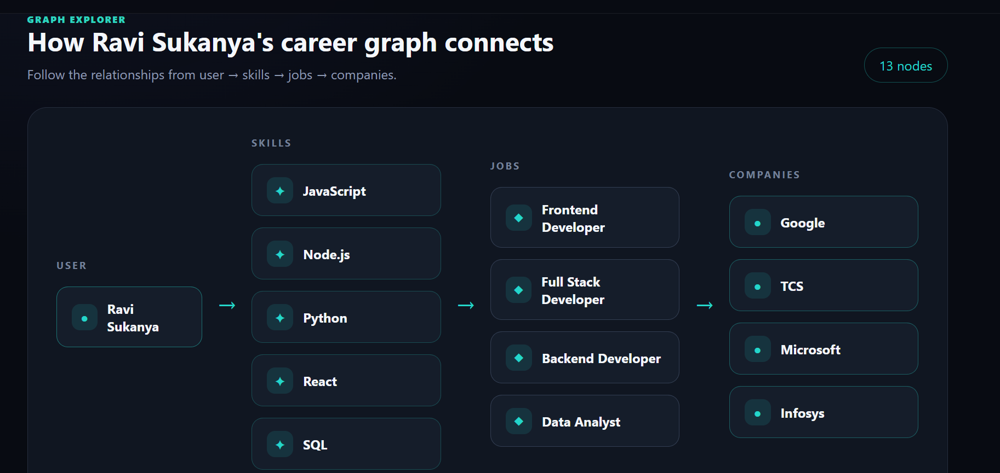

# SkillGraph

SkillGraph is a graph-powered career exploration application built with React, Express, Neo4j Driver, and CognoDB.

The application connects users with their skills, career opportunities, and companies using a graph database.

## Features

- User registration and login
- Password hashing using bcrypt
- JWT-based authentication
- CognoDB graph database integration
- Skills → Jobs → Companies graph traversal
- Interactive graph explorer
- Career path exploration
- Loading, empty, and error states
- Responsive and clean UI
- REST API built with Express
- Realistic graph seed data

## Why a Graph Database?

Career relationships are naturally connected.

A user can have multiple skills, each skill can be useful for multiple jobs, and each job can be offered by multiple companies.

The main graph relationship is:

User → Skill → Job → Company

For example:

User
→ JavaScript
→ Frontend Developer
→ Google

This type of multi-hop relationship is natural to represent and query using a graph database.

In a relational database, this would require multiple tables and JOIN operations between users, skills, jobs, companies, and mapping tables.

CognoDB makes these connected relationships explicit through nodes and typed relationships, making graph traversal queries easier to express and understand.

## Graph Data Model

### Nodes

- `User`
  - name
  - email
  - passwordHash

- `Skill`
  - name

- `Job`
  - title

- `Company`
  - name

### Relationships

- `User -[:HAS_SKILL]-> Skill`
- `Skill -[:REQUIRED_FOR]-> Job`
- `Job -[:OFFERED_BY]-> Company`

### Graph Structure

```text
                 HAS_SKILL
User ─────────────────────────> Skill
                                  │
                                  │ REQUIRED_FOR
                                  ▼
                                 Job
                                  │
                                  │ OFFERED_BY
                                  ▼
                               Company
                           

````
## Main Graph Query

The application uses a multi-hop traversal:

```cypher
MATCH (u:User {name: $name})
      -[:HAS_SKILL]->(s:Skill)
      -[:REQUIRED_FOR]->(j:Job)
      -[:OFFERED_BY]->(c:Company)
RETURN
  u.name AS user,
  s.name AS skill,
  j.title AS job,
  c.name AS company
ORDER BY skill, job
````

The query traverses four connected node types:

```text
User → Skill → Job → Company
```

The query is parameterised using `$name`, so user input is not concatenated directly into the Cypher query.

## Another Graph Query

The application also retrieves graph relationships:

```cypher
MATCH (n)-[r]->(m)
RETURN
  labels(n) AS fromLabels,
  properties(n) AS fromProperties,
  type(r) AS relationship,
  labels(m) AS toLabels,
  properties(m) AS toProperties
LIMIT 100
```

This query powers the graph exploration functionality.

## Technology Stack

### Frontend

* React
* Vite
* JavaScript
* CSS

### Backend

* Node.js
* Express
* CORS
* JWT
* bcryptjs

### Database

* CognoDB
* Neo4j JavaScript Driver
* openCypher
* Bolt protocol

### Deployment

* Render
* GitHub

## Project Structure

```text
skill graph/
│
├── client/
│   ├── src/
│   │   ├── App.jsx
│   │   ├── App.css
│   │   ├── Login.jsx
│   │   ├── Register.jsx
│   │   ├── GraphExplorer.jsx
│   │   └── ...
│   │
│   └── package.json
│
├── server/
│   ├── src/
│   │   ├── server.js
│   │   └── database.js
│   │
│   ├── scripts/
│   │   └── seed.js
│   │
│   ├── .env
│   └── package.json
│
└── README.md
```

## Authentication

SkillGraph supports user registration and login.

Passwords are never stored as plain text.

During registration:

```text
Password
   ↓
bcrypt hash
   ↓
passwordHash
   ↓
CognoDB
```

During login:

```text
Email + Password
       ↓
Find User
       ↓
bcrypt.compare()
       ↓
JWT token
       ↓
Authenticated application
```

The JWT token is stored on the client side and used to maintain the authenticated session.

## Environment Variables

Create a `.env` file inside the `server` directory.

```env
COGNODB_URI=your_cognodb_bolt_uri
COGNODB_USERNAME=cognodb
COGNODB_PASSWORD=your_cognodb_password
JWT_SECRET=your_jwt_secret
```

Never commit `.env` or database credentials to GitHub.

## Setting Up CognoDB

1. Create a CognoDB Cloud account.
2. Create a free C0 instance.
3. Select a region.
4. Copy the generated Bolt connection URI.
5. Save the generated database password.
6. Add the connection details to `server/.env`.

Example:

```env
COGNODB_URI=bolt+s://your-instance.databases.cognodb.cloud
COGNODB_USERNAME=cognodb
COGNODB_PASSWORD=your_password
JWT_SECRET=your_secret
```

## Install Dependencies

### Backend

```bash
cd server
npm install
```

### Frontend

Open another terminal:

```bash
cd client
npm install
```

## Seed the Database

The repository contains a seed script with realistic graph data.

From the `server` directory:

```bash
node scripts/seed.js
```

The seed script creates:

* Users
* Skills
* Jobs
* Companies
* User-skill relationships
* Skill-job relationships
* Job-company relationships

Example graph:

```text
User
 │
 └── HAS_SKILL
        │
        ▼
      Skill
        │
        └── REQUIRED_FOR
                │
                ▼
               Job
                │
                └── OFFERED_BY
                        │
                        ▼
                     Company
```

## Run the Backend

From the `server` directory:

```bash
npm start
```

The backend runs on the configured port.

Health check:

```text
/api/health
```

Database test:

```text
/api/db-test
```

## Run the Frontend

From the `client` directory:

```bash
npm run dev
```

The frontend communicates with the deployed Express API.

## API Endpoints

### Health Check

```http
GET /api/health
```

### Database Test

```http
GET /api/db-test
```

### Graph Data

```http
GET /api/graph
```

### Career Paths

```http
GET /api/career-path/:name
```

### Register

```http
POST /api/auth/register
```

Request body:

```json
{
  "name": "Example User",
  "email": "user@example.com",
  "password": "password123"
}
```

### Login

```http
POST /api/auth/login
```

Request body:

```json
{
  "email": "user@example.com",
  "password": "password123"
}
```

## Error Handling

The application handles common failure states.

### Frontend

* Loading state
* Empty state
* Database connection error
* Failed API request
* Retry button
* Login errors
* Registration errors

### Backend

API failures return JSON responses with:

```json
{
  "success": false,
  "message": "Error message"
}
```

Database sessions are closed using `finally` blocks.

## Parameterised Cypher

All application Cypher queries use parameters.

Example:

```javascript
await session.run(
  `
  MATCH (u:User {name: $name})
  RETURN u
  `,
  { name }
);
```

This avoids string-concatenating user input into Cypher queries.

## Multi-Hop Traversal

The primary career query performs a multi-hop traversal:

```text
User
 ↓
Skill
 ↓
Job
 ↓
Company
```

This is the core graph use case of the application.

## Hosted Application

Frontend:

```text
https://YOUR-FRONTEND-URL
```

Backend:

```text
https://skill-graph-cognodb.onrender.com
```

## Screenshots

### Login

Add the application login screenshot here.

```text

```

### Register

Add the registration screenshot here.

```text

```

### Career Explorer

Add the main SkillGraph dashboard screenshot here.

```text

```

### Graph Explorer

Add the graph visualization screenshot here.

```text

```

## Future Improvements

Possible future improvements include:

* More detailed career recommendations
* Skill similarity analysis
* Job filtering
* Company comparison
* Skill gap analysis
* More graph relationships
* Role-based authentication
* Improved graph visualization
* Additional real-world career datasets

## Assignment

This project was created as a take-home assignment for Wexa AI.

The application demonstrates:

* Graph data modeling
* CognoDB integration
* Neo4j Driver usage
* Multi-hop graph traversal
* Parameterised Cypher queries
* REST API design
* Authentication
* React UI/UX
* Error handling
* Deployment

```

